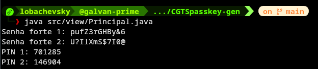
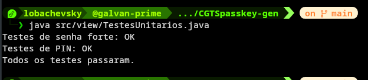

# Gerador de Credenciais
---
__Projeto para a atividade prática de LPG3.__

## Estrutura desenvolvida
- `GeradorSenha`: Contrato para geração de credenciais.
- `GeradorSenhaBase`: Classe abstrata com recursos comuns de geração.
- `Principal`: Ponto inicial para execução.
- `TestesUnitários`: Ponto principal para execução dos testes, validando se as senhas estão conforme o enunciado.

---


**Para executar o programa:**
```bash
java src/view/TestesManuais.java
```
---


**Para executar os Testes:**
```bash
java src/view/TestesUnitários.java
```

